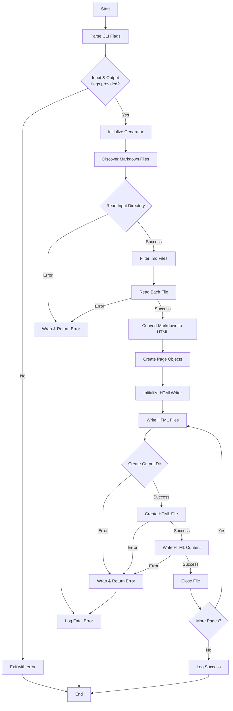

# SSG Generator

A Static Site Generator written in Go that converts Markdown files to HTML.

## Features

- **CLI Flags**: Supports `-input` and `-output` flags for specifying source and destination directories
- **Markdown Discovery**: Automatically discovers all `.md` files in the input directory
- **Markdown → HTML Conversion**: Converts Markdown headers (#, ##) and paragraphs to HTML
- **HTML Writer**: Creates output directories and writes HTML files with proper structure
- **Error Wrapping Discipline**: Comprehensive error handling with wrapped errors for better debugging
- **Clean Architecture**: Separated concerns with interfaces for file system operations
- **Test Coverage**: Unit tests for core components

## Architecture

The project follows a clean architecture pattern with the following components:

- **cmd/ssg/main.go**: CLI entry point, flag parsing, and orchestration
- **internal/site/**: Page models and generator logic
- **internal/markdown/**: Markdown to HTML parser
- **internal/writer/**: HTML file writer with directory creation
- **internal/fs/**: File system abstraction (reader interfaces)

## How to Run

### Prerequisites

- Go 1.25.2 or later

### Build

```bash
go build -o ssg ./cmd/ssg/main.go
```

### Run

```bash
./ssg -input ./testdata/input -output ./testdata/output
```

Or with the pre-built binary:

```bash
./ssg -input <input-directory> -output <output-directory>
```

### Example

```bash
# Using the provided test data
./ssg -input ./testdata/input -output ./output

# This will convert:
# - ./testdata/input/index.md → ./output/index.html
# - ./testdata/input/about.md → ./output/about.html
```

## Project Structure

```
.
├── cmd/ssg/main.go              # CLI entry point
├── internal/
│   ├── site/
│   │   ├── generator.go         # Page discovery logic
│   │   ├── generator_test.go    # Generator tests
│   │   └── page.go              # Page data structure
│   ├── markdown/
│   │   ├── parser.go            # Markdown → HTML converter
│   │   └── parser_test.go       # Parser tests
│   ├── writer/
│   │   ├── html_writer.go       # HTML file writer
│   │   ├── html_writer_test.go  # Writer tests
│   │   ├── file_creator.go      # File creator interface
│   │   └── os_creator.go        # OS file creator implementation
│   └── fs/
│       ├── reader.go            # File reader interface
│       ├── os_reader.go         # OS file reader implementation
│       └── fake_reader.go       # Fake reader for testing
├── testdata/
│   └── input/
│       ├── index.md             # Sample markdown file
│       └── about.md             # Sample markdown file
├── go.mod                       # Go module definition
├── ssg                          # Pre-built binary
└── README.md                    # This file
```

## Flowchart



## Error Handling

The project implements proper error wrapping discipline:

- `ErrDiscoveryFailed`: Page discovery failed
- `ErrReadInputDir`: Failed to read input directory
- `ErrReadFile`: Failed to read specific file
- `ErrCreateOutputDir`: Failed to create output directory
- `ErrCreateFile`: Failed to create output file
- `ErrWriteFile`: Failed to write to file

All errors are wrapped with context using `fmt.Errorf("%w: %w", ...)` for better traceability.

## Testing

Run tests with:

```bash
go test ./...
```

## License

MIT
